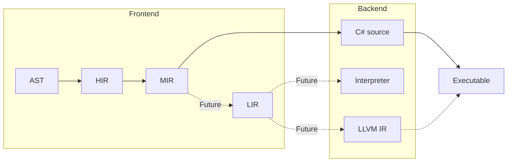

This page contains a high level breakdown of the different 
steps needed to compile Mew code.

Everything drawn with a dotted line is planned rather than built. Today the
only backend is the C# transpiler, and it is reached through `MIR`, because the
control flow analysis that runs there is what the compiler's warnings are built
on.

## 1. AST Parsing

The parsing step iterates through all source files, and
builds a syntax tree for each of them.  
The syntax tree represents the code as it was written, 
maintaining the trivia such as white space, comments etc.

Each node in the AST has a reference to both it's parent
and children. 

Apart from being the basis for `HIR` generation, the AST
is also used to interact with the source code programatically,
i.e. from the LSP server.

## 2. HIR generation

HIR, short for _High-level Intermediate Representation_, 
represents a bound tree, where all types are known.  

The HIR references resolved _symbols_ for the different parts
of Mew (namespaces, types, functions, parameters, variables etc).
For example, two code block that calls a function, will have
the same symbol reference to that function.

1. Build symbol table
   1. Namespaces
   1. Types
   1. Free functions
   1. Type members
1. Binding
   1. Types
   1. Free functions
   1. Top level statements

> [!IMPORTANT]
> HIR might contain errors, represented as error symbols.

## 3. MIR generation

MIR, short for _Medium-level Intermediate Representation_,
is a lowered HIR, without constructs such as `while`/`loop`/`if`.

* All higher level constructs such as loops and conditions 
been lowered into labels and branches.
* Control flow analysis and some optimizations 
are done here as well.

> [!IMPORTANT]
> MIR might contain errors, represented as error symbols.

## 4. C# transpilation

The only backend that exists today emits C# source. It takes
`MIR`, so the control flow analysis behind the compiler's
warnings has run before anything is emitted. The code itself is
written from the `HIR` that `MIR` carries, because C# has the
structured control flow that `MIR` lowers away.

The C# is compiled in process, and the assembly is written to a
`.mew` directory beside the file the program starts from. The
.NET SDK is not involved, and neither is a project file. A build
is skipped when nothing that decides the assembly has changed.

The C# it emits is an implementation detail. Nothing about the
language is defined in terms of what C# does, so a `bool` in an
interpolated string is written `true` rather than the `True`
that C# would produce on its own.

> [!IMPORTANT]
> This step is a stepping stone, not the intended end state.

## 5. LIR generation

> [!IMPORTANT]
> This functionality is not yet implemented

LIR, short for _Low-level Intermediate Representation_,
is a lowered MIR, resembling the final byte code that will 
be emitted.

> [!WARNING]
> LIR **MUST NOT** contain any errors.