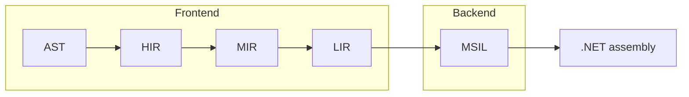

This page contains a high level breakdown of the different 
steps needed to compile Mew code.

```mermaid
flowchart LR;
    subgraph Frontend
    AST-->HIR
    HIR-->MIR
    MIR-->LIR
    end
    subgraph Backend
    LIR-->MSIL["MSIL"]
    end
    MSIL-->Assembly[".NET assembly"]
```

The backend writes MSIL, and it is reached through `LIR`.

## 1. AST Parsing

The parsing step iterates through all source files, and
builds a syntax tree for each of them.  
The syntax tree represents the code as it was written, 
maintaining the trivia such as white space, comments etc.

Each node in the AST has a reference to both it's parent
and children. 

Apart from being the basis for `HIR` generation, the AST
is also used to interact with the source code programatically,
i.e. from the LSP server.

## 2. HIR generation

HIR, short for _High-level Intermediate Representation_, 
represents a bound tree, where all types are known.  

The HIR references resolved _symbols_ for the different parts
of Mew (namespaces, types, functions, parameters, variables etc).
For example, two code block that calls a function, will have
the same symbol reference to that function.

1. Build symbol table
   1. Namespaces
   1. Types
   1. Free functions
   1. Type members
1. Binding
   1. Types
   1. Free functions
   1. Top level statements

> [!IMPORTANT]
> HIR might contain errors, represented as error symbols.

## 3. MIR generation

MIR, short for _Medium-level Intermediate Representation_,
is a lowered HIR, without constructs such as `while`/`loop`/`if`.

* All higher level constructs such as loops and conditions 
been lowered into labels and branches.
* Control flow analysis and some optimizations 
are done here as well.

> [!IMPORTANT]
> MIR might contain errors, represented as error symbols.

## 4. LIR generation

LIR, short for _Low-level Intermediate Representation_,
is a lowered MIR, shaped like the instructions that will be
emitted.

Where MIR is still a tree, LIR is a flat list per method over an
evaluation stack. It numbers the locals, makes every conversion
and every box explicit, resolves which member a name meant, and
turns a lambda into a type. It is still typed with the compiler's
own symbols rather than with .NET's, so it can be read back and
compared in a test.

> [!WARNING]
> LIR **MUST NOT** contain any errors.

A function the lowering cannot finish is recorded rather than
half-written, and the backend refuses the whole program instead
of emitting a module with a hole in it.

## 5. Writing the assembly

The backend turns LIR into a .NET assembly with
`System.Reflection.Metadata`, writing the IL itself rather than
going through another language. It is written to a `.mew`
directory beside the file the program starts from, together with
the runtime configuration the host reads. The .NET SDK is not
involved, and neither is a project file.

Nothing above LIR knows how a program is written out, so the
language is not defined in terms of what .NET does. The symbol
model does read .NET metadata, which is what lets a program name
a platform type.

A debug database is written beside the assembly, so a debugger
can stop on a line of Mew.