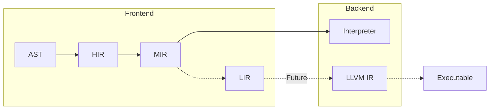

# Compiler

This page contains a high level breakdown of the different 
steps needed to compile Mew code.

## 1. AST Parsing

The parsing step iterates through all source files, and
builds a syntax tree for each of them.  
The syntax tree represents the code as it was written, 
maintaining the trivia such as white space, comments etc.

Each node in the AST has a reference to both it's parent
and children. 

Apart from being the basis for `HIR` generation, the AST
is also used to interact with the source code programatically,
i.e. from the LSP server.

## 2. HIR generation

HIR, short for _High-level Intermediate Representation_, 
represents a bound tree, where all types are known.  

The HIR references resolved _symbols_ for the different parts
of Mew (namespaces, types, functions, parameters, variables etc).
For example, two code block that calls a function, will have
the same symbol reference to that function.

1. Build symbol table
   1. Namespaces
   1. Types
   1. Free functions
   1. Type members
1. Binding
   1. Types
   1. Free functions
   1. Top level statements

:::info
HIR might contain errors, represented as error symbols.
:::

## 3. MIR generation

MIR, short for _Medium-level Intermediate Representation_,
is a lowered HIR, without constructs such as `while`/`loop`/`if`.

* All higher level constructs such as loops and conditions 
been lowered into labels and branches.
* Control flow analysis and some optimizations 
are done here as well.

:::info
MIR might contain errors, represented as error symbols.
:::

## 4. LIR generation

LIR, short for _Low-level Intermediate Representation_,
is a lowered MIR, resembling the final byte code that will 
be emitted.

:::warning
LIR **MUST NOT** contain any errors.
:::

## 5. Emitting

Finally, the LIR is transpiled into Mew bytecode which can be
interpreted by the Mew interpreter.

:::note
There are plans in the future to create a LLVM IR emitter,
but until the language settles a bit, the undertaking is 
a bit too much.
:::